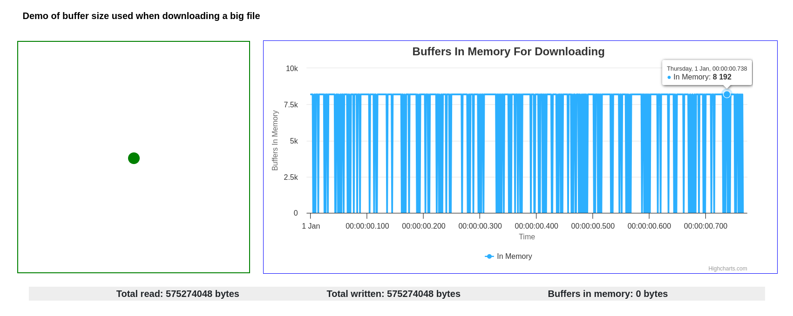
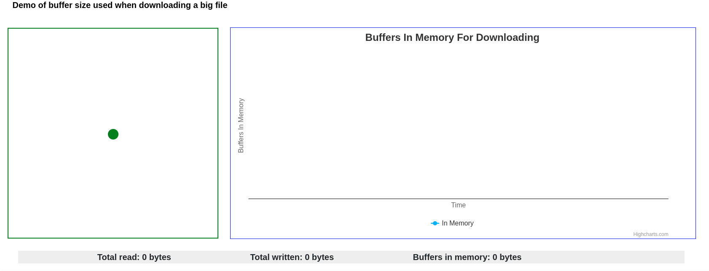
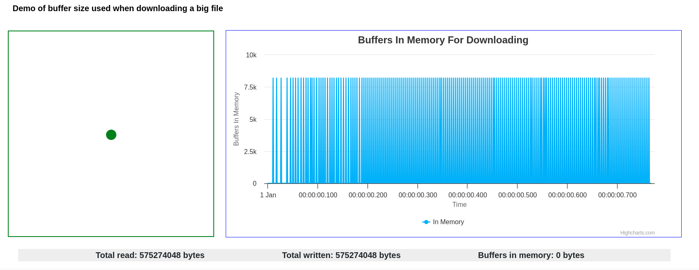
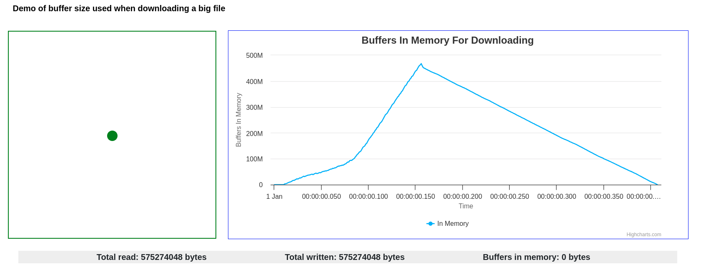
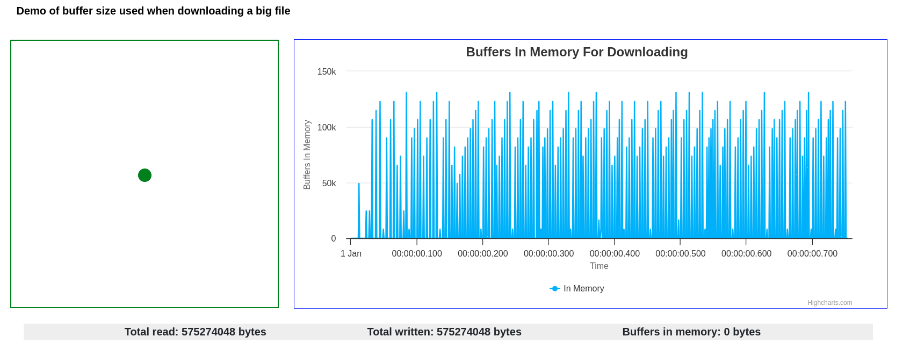

# vertx-demos-backpressure

Vertx demos to show how backpressure is addressed

The project simply shows how downloading a big file from server consumes memory in the server side.

It assumes there is a file located at `~/large.bin` by default, you can also specify via system property `download.file.path` to use different file for the demonstration.

## Build the project

> mvn clean install

## Run the server

> java -jar target/vertx-demos-backpressure-0.0.1-fat.jar

or specify different file for the demonstration

> java -Ddownload.file.path=xxx.file -jar target/vertx-demos-backpressure-0.0.1-fat.jar

You will see the logs like:

```bash
[🎩 lgao@lins-p1 backpressure]$ java -jar target/vertx-demos-backpressure-0.0.1-fat.jar 
[main] INFO main - File Size to be downloaded has 575274048 bytes
[main] INFO main - Starting the Undertow server at port 8080 ...
Nov 05, 2023 8:20:47 PM io.undertow.Undertow start
INFO: starting server: Undertow - 2.3.5.Final
Nov 05, 2023 8:20:47 PM org.xnio.Xnio <clinit>
INFO: XNIO version 3.8.8.Final
Nov 05, 2023 8:20:47 PM org.xnio.nio.NioXnio <clinit>
INFO: XNIO NIO Implementation Version 3.8.8.Final
Nov 05, 2023 8:20:47 PM org.jboss.threads.Version <clinit>
INFO: JBoss Threads version 3.5.0.Final
[main] INFO main - Undertow server started!
[main] INFO main - 	 ======
[main] INFO main - Starting Vertx instance for Non Blocking Downloader...
[vert.x-eventloop-thread-0] INFO VertxHttpServer - Starts HttpServer using Vert.x at: 8000
[vert.x-eventloop-thread-0] INFO VertxHttpServer - EventBus is on the path /eventbus/
[vert.x-eventloop-thread-0] INFO VertxHttpServer - VertxHttpServer deployed!
[vert.x-eventloop-thread-1] INFO main - Download the file using blocking i/o at: http://localhost:8080/bio/download
[vert.x-eventloop-thread-1] INFO main - Download the file using non blocking i/o at: http://localhost:8000/nio/download
[vert.x-eventloop-thread-1] INFO main - Download the file using non blocking i/o with fix at: http://localhost:8000/nio/download-fix
```

The server starts 2 http servers, one is using undertow to start a server at port `8080` for the blocking i/o downloading, the other is using vert.x to start a http server at port `8000` for the non-blocking i/o downloading, it also sets up the sockjs eventbus bridge so that the statistics data can be displayed in a web page.

## See the UI for the demonstration

Open your web browser to access http://localhost:8000/

You will see some diagrams. There is a square with a green dot inside in the left, which indicates memory usage with the dot size and color. There is a chart in the right panel which records the memory usage during the downloading time. and there are some information below like:
* Total read `xxx` bytes
* Total written `xxx` bytes
* Buffers in memory `xxx` bytes

The test file to download in my machine has `575274048` bytes, and the chunk size (`CHUNK_SIZE`) used in the following screenshot is `8192`.

## Emulates slow network
To simulate the real internet situation, it is better to have an environment with a slow network for the demonstration, I am using Fedora 36, so what I do is:

* Switch to `root` via `su -` and run:
> tc qdisc add dev lo root netem delay 50ms

  Now the network traffic using `lo` net device has `50ms` of delay. You will see that there is no difference of memory usage.

* Remember to remove the network delay via:
> tc qdisc del dev lo root netem delay 50ms

## Testing using blocking i/o

> curl -s "http://localhost:8080/bio/download" --output out.bio

This will download the file from the undertow http server using blocking i/o, at the same time, the web ui will show the buffers in the server in realtime.

The sample code of using blocking i/o is like:

```java
try (InputStream input = Files.newInputStream(downloadFile, StandardOpenOption.READ);
     OutputStream output = exchange.getOutputStream()) {
    byte[] buffer = new byte[CHUNK_SIZE];
    int len;
    while ((len = input.read(buffer)) != -1) {
        notification.notice(len, 0);
        // it blocks when data has been not flushed to remote
        output.write(buffer, 0, len);
        output.flush();
        notification.notice(0, len);
    }
}
```
The memory consumption during the file downloading in the web UI is like:

The left green dot looks no changing, that is because the chunk size used during the file downloading is much smaller than the file itself. The right chart records the memory usage during the downloading, there is a bouncing from 0 to 8192.

## Testing using non-blocking i/o having problems

> curl -s "http://localhost:8000/nio/download" --output out.nio

This will download the file from the vertx http server using non-blocking i/o, at the same time, the web ui will show the buffers in the server in realtime. It has memory consumption problem here, because it does not handle backpressure.

I am using Vert.x as the sample code for this:

```java
vertx.fileSystem().open(downloadFile.toAbsolutePath().toString(), new OpenOptions(), ar -> {
    if (ar.succeeded()) {
        AsyncFile file = ar.result().setReadBufferSize(CHUNK_SIZE);
        file.handler(buffer -> {
            notification.notice(buffer.length(), 0);
            ctx.response().write(buffer, h -> {
                if (h.succeeded()) {
                    notification.notice(0, buffer.length());
                } else {
                    ctx.fail(h.cause());
                }
            });
        })
        .exceptionHandler(ctx::fail)
        .endHandler(h -> endNio(ctx, notification));
    } else {
        ctx.fail(ar.cause());
    }
});
```
We specify a handler to consume the content when AsyncFile starts reading the file. AsyncFile works in `flowing` mode, so it starts reading data and passing the data into the handler.



There is a peak memory usage which is above `500MB`, basically it reads all content from the file before it is able to write the content to the remote client. It is because the reading happens on the different thread than writing and there is no control over the speed.

## Testing using non-blocking i/o with backpressure supported

> curl -s "http://localhost:8000/nio/download-fix" --output out.nio.fix



With the backpressure support, in Vert.x api, it uses something like:

```java
if (ctx.response().writeQueueFull()) {
    file.pause();
    ctx.response().drainHandler(drainHandler);
}
```
after calling `ctx.response().write(buffer);`. which fixed the high memory usage in the previous one. Both the time and memory usage is almost the same as the one using blocking I/O.

### Testing using NIO with rxjava version of API

> curl -s "http://localhost:8000/nio/download-rx" --output out.nio.rx



This tries to use rxjava version of vert.x api to download the file, the code is like: 

```java
final WriteStreamSubscriber<Buffer> subscriber = ctx.response().setWriteQueueMaxSize(CHUNK_SIZE).toSubscriber()
        .onWriteStreamError(ctx::fail)
        .onWriteStreamEndError(ctx::fail)
        .onError(ctx::fail)
        .onWriteStreamEnd(ctx::end);
rxVertx.fileSystem()
        .rxOpen(downloadFile.toAbsolutePath().toString(), new OpenOptions())
        .flatMapPublisher(io.vertx.rxjava3.core.file.AsyncFile::toFlowable)
        .subscribe(subscriber::onNext, subscriber::onError, subscriber::onComplete);
```
We can still see a peak memory usage this time, that is because we are using `@BackpressureSupport(BackpressureKind.UNBOUNDED_IN)` subscribe method in the Flowable, which tries to read `Long.MAX_VALUE` of content on subscription from the underline stream.

Perhaps rxjava should use a different name for this purpose instead of an annotation flag.

### Testing using NIO with rxjava version of API with some tweaks

> curl -s "http://localhost:8000/nio/download-rx-fix" --output out.nio.rx.fix



The code is like:

```java
final WriteStreamSubscriber<Buffer> subscriber = ctx.response().setWriteQueueMaxSize(CHUNK_SIZE).toSubscriber()
        .onWriteStreamError(ctx::fail)
        .onWriteStreamEndError(ctx::fail)
        .onError(ctx::fail)
        .onWriteStreamEnd(ctx::end);
rxVertx.fileSystem()
        .rxOpen(downloadFile.toAbsolutePath().toString(), new OpenOptions())
        .flatMapPublisher(io.vertx.rxjava3.core.file.AsyncFile::toFlowable)
        .doOnNext(n -> notification.notice(n.length(), 0))
        .subscribe(subscriber);
```

Now the memory usage becomes normal than the previous one. The only difference in code with previous one is that we are using a `@BackpressureSupport(BackpressureKind.SPECIAL)` version of subscribe method of Flowable.

But still we can see the memory usage is a little bigger than using raw Vert.x API which has finer flow control.
